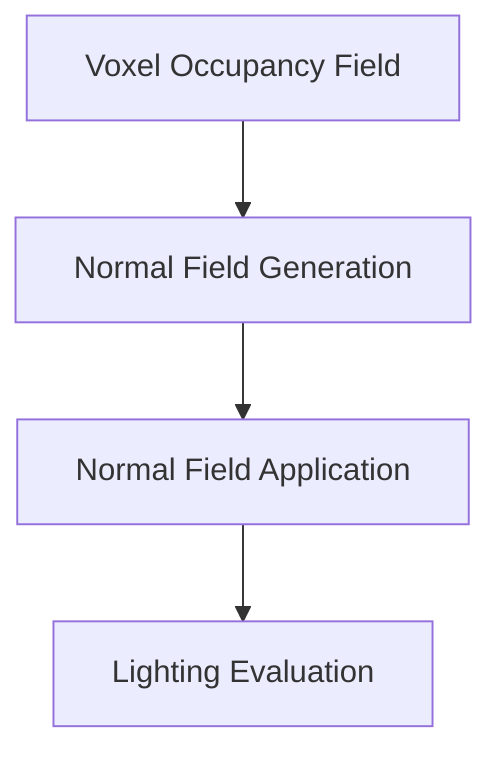
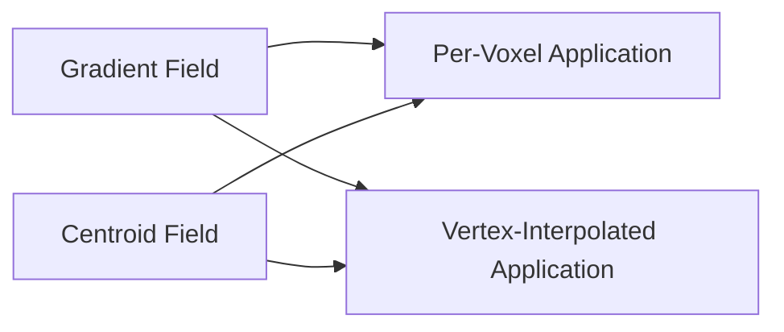

# Derived Surface Shading for Voxel Fields

## Abstract

Traditional voxel rendering illuminates visible cube faces using the geometric normals of the underlying voxel geometry. While this approach reinforces the block-based aesthetic of voxel graphics, it causes lighting to describe the voxel lattice rather than the shape represented by the voxel field.

This paper explores a family of techniques collectively referred to as **Derived Surface Shading (DSS)**. DSS preserves voxel geometry and silhouettes while deriving lighting information from the occupancy field itself. Rather than treating each visible cube face as an independent lighting primitive, DSS attempts to estimate the orientation of the surface implied by neighboring voxels.

The central observation is that a voxel model contains two distinct representations simultaneously:

1. Explicit cube geometry.
2. An implicit surface represented by voxel occupancy.

Traditional voxel rendering shades the former. DSS shades the latter.

Several approaches to surface normal derivation are examined, including density-gradient fields, occupancy-centroid fields, and vertex-interpolated normal fields. These techniques are organized into a framework that separates the problem into two orthogonal stages:

1. Surface normal derivation from occupancy.
2. Surface normal application during shading.

This decomposition creates a broad design space that preserves voxel geometry while allowing illumination to communicate larger-scale shape information.

---

# 1. Introduction

Voxel rendering occupies an unusual position within computer graphics.

Unlike polygonal rendering, where geometry explicitly defines a surface, voxel models are volumetric. Yet most voxel renderers ultimately convert this volume into visible cube faces and illuminate those faces using conventional geometric normals.

For a visible voxel:

```text
Top    -> ( 0, 1, 0)
Bottom -> ( 0,-1, 0)
Left   -> (-1, 0, 0)
Right  -> ( 1, 0, 0)
Front  -> ( 0, 0, 1)
Back   -> ( 0, 0,-1)
```

This approach is computationally efficient and visually recognizable. It is also deeply tied to the visual identity of voxel graphics.

However, it produces an important artifact:

> Lighting describes the voxel lattice rather than the represented shape.

Consider a voxelized sphere.

The occupancy field clearly represents a sphere. Yet traditional lighting causes illumination to follow the orientation of individual cube faces, emphasizing stair-stepping artifacts and obscuring larger-scale form.

This effect becomes increasingly apparent as voxel resolution increases. At sufficiently high resolutions, viewers often perceive the object as a sampled surface rather than a collection of intentionally visible cubes.

This paper investigates an alternative approach:

> Can voxel geometry remain unchanged while lighting communicates the surface implied by the occupancy field?

---

## Figure 1. Traditional Voxel Shading vs Derived Surface Shading

**[SCREENSHOT PLACEHOLDER]**

Depict two identical voxelized spheres.

Left:

- Traditional cube-face shading.
- Lighting follows voxel faces.
- Stair-step artifacts emphasized.

Right:

- Occupancy-derived shading.
- Lighting follows the implied spherical form.
- Geometry remains unchanged.

Purpose:

Introduce the central motivation of the paper.

---

# 2. Geometry and Representation

The key insight behind DSS is that a voxel model contains two simultaneous representations.

## Explicit Representation

The explicit representation consists of visible cube geometry.

This is the geometry submitted to the renderer.

```text
Voxel Field
    ↓
Visible Cube Faces
    ↓
Rasterization
```

This representation defines:

- Silhouette
- Topology
- Visible geometry

---

## Implicit Representation

The implicit representation consists of the occupancy field itself.

Humans often interpret this field as an approximation of a continuous surface.

A voxelized sphere is still perceived as a sphere.

A voxelized character is still perceived as a character.

A voxelized terrain hill is still perceived as a hill.

This implicit representation is not explicitly stored as geometry, yet it strongly influences perception.

DSS attempts to derive lighting information from this representation.

---

## Figure 2. Explicit Geometry vs Implicit Surface

**[SCREENSHOT PLACEHOLDER]**

Depict:

- Raw voxel occupancy.
- Visible cube geometry.
- Artist-perceived surface overlay.

Purpose:

Illustrate the distinction between geometric representation and perceived form.

---

# 3. Derived Surface Shading

Derived Surface Shading is defined as:

> Any shading method that derives surface orientation from voxel occupancy rather than cube geometry.

Traditional voxel shading:

```text
Voxel Field
    ↓
Cube Geometry
    ↓
Cube Face Normal
    ↓
Lighting
```

Derived Surface Shading:

```text
Voxel Field
    ↓
Derived Surface Normal Field
    ↓
Lighting
```

The renderer continues to draw cubes.

Only the source of normal information changes.

---

# 4. System Architecture

During experimentation, it became apparent that DSS naturally decomposes into two independent problems.

1. How should surface orientation be extracted from occupancy?
2. How should that orientation be applied during lighting?

This distinction proved more useful than reasoning about individual algorithms.



**Figure 3.** High-level DSS architecture.

---

## 4.1 Normal Field Generation

Generate a field of surface normals from occupancy.

Possible methods:

- Density Gradient
- Occupancy Centroid
- Future techniques

---

## 4.2 Normal Field Application

Apply the generated normal field during lighting.

Possible methods:

- Uniform Per Voxel
- Vertex Interpolated

---

The resulting design space is:



**Figure 4.** Normal generation and normal application are independent axes.

---

# 5. Occupancy Fields

Let:

```text
V(x,y,z) ∈ {0,1}
```

represent voxel occupancy.

Where:

```text
1 = occupied
0 = empty
```

The occupancy field therefore defines a discrete volume.

The purpose of DSS is to estimate the orientation of the surface implied by this volume.

---

# 6. Density Gradient Fields

## 6.1 Motivation

A surface normal may be interpreted as the direction of greatest change between solid and empty space.

This suggests treating occupancy as a density field.

The desired normal becomes:

```text
N = ∇ρ
```

where:

```text
ρ(x,y,z)
```

is a smoothed occupancy density.

---

## 6.2 Density Estimation

Occupancy is first blurred using a weighted kernel.

For a sample position:

```text
p = (x,y,z)
```

density is estimated as:

```text
ρ(p) =
Σ V(q) w(q)
-----------
Σ w(q)
```

where:

```text
q ∈ Neighborhood(p)
```

and:

```text
w(q)
```

is a weighting function.

The prototype implementation uses Gaussian weighting:

```text
w = exp(-d² / 2σ²)
```

where:

```text
d = |q - p|
```

---

## 6.3 Gradient Estimation

The density gradient is estimated using finite differences:

```text
Nx = ρ(x-r,y,z) - ρ(x+r,y,z)

Ny = ρ(x,y-r,z) - ρ(x,y+r,z)

Nz = ρ(x,y,z-r) - ρ(x,y,z+r)
```

The resulting vector is normalized:

```text
N = normalize(Nx,Ny,Nz)
```

---

## 6.4 Interpretation

Density-gradient normals answer:

> Which direction leads from solid space toward empty space?

This interpretation is closely related to surface normal generation in:

- Volume rendering
- Signed Distance Fields
- Marching Cubes
- Surface Nets

Unlike those systems, DSS does not reconstruct geometry.

---

## Figure 5. Density Gradient Normal Estimation

**[MERMAID PLACEHOLDER]**

Depict:

- Density samples at opposite sides of a voxel.
- Computation of finite differences.
- Resulting normal.

Purpose:

Illustrate how occupancy density produces surface orientation.

---

# 7. Occupancy Centroid Fields

## 7.1 Motivation

An alternative interpretation is based on mass distribution.

Instead of detecting surface transitions, the renderer asks:

> Where is nearby occupied space concentrated?

---

## 7.2 Centroid Computation

For voxel position:

```text
p
```

the weighted occupancy centroid is:

```text
C =
Σ V(q) w(q) q
-------------
Σ V(q) w(q)
```

where:

```text
q
```

belongs to the neighborhood kernel.

---

## 7.3 Normal Derivation

The normal points away from the centroid:

```text
N = normalize(p - C)
```

---

## 7.4 Interpretation

Centroid normals estimate the direction away from nearby occupied mass.

This creates a more sculptural interpretation of the occupancy field.

Large kernels increasingly emphasize overall form rather than local topology.

---

## Figure 6. Occupancy Centroid Normal Estimation

**[SCREENSHOT PLACEHOLDER]**

Depict:

- Kernel neighborhood.
- Occupied voxels.
- Computed centroid.
- Resulting outward normal.

Purpose:

Illustrate the mass-distribution interpretation.

---

# 8. Kernel Radius

Both explored approaches rely on a neighborhood kernel.

Let:

```text
r
```

represent kernel radius.

| Radius | Kernel Size |
| ------ | ----------- |
| 1      | 3×3×3       |
| 2      | 5×5×5       |
| 3      | 7×7×7       |
| 4      | 9×9×9       |

Increasing radius causes normals to become increasingly influenced by larger-scale structures.

Small kernels:

- Preserve local detail.
- React strongly to stair-stepping.

Large kernels:

- Produce smoother fields.
- Better communicate global form.

---

## Figure 7. Kernel Radius Comparison

**[SCREENSHOT PLACEHOLDER]**

Rows:

- Gradient
- Centroid

Columns:

- Radius 1
- Radius 2
- Radius 3
- Radius 4

Purpose:

Visualize the transition from local topology to global form.

---

# 9. Experimental Observation

A notable result emerged during testing.

For many shapes:

```text
Centroid(radius n)
≈
Gradient(radius n-1)
```

visually.

Although the algorithms are conceptually different, both tend to align with the dominant direction toward empty space.

This suggests that density-gradient methods may produce comparable results using smaller kernels.

The observation remains qualitative and warrants future quantitative analysis.

---

## Figure 8. Gradient vs Centroid Similarity

**[SCREENSHOT PLACEHOLDER]**

Show:

- Gradient Radius 2
- Centroid Radius 3

Side-by-side.

Purpose:

Illustrate the observed convergence between the methods.

---

# 10. Normal Field Application

The normal field and its application are independent concerns.

The same normal field can be shaded in multiple ways.

---

## 10.1 Uniform Per-Voxel Application

A single derived normal is assigned to an entire voxel.

All visible faces share the same lighting result.

```text
Voxel
    ↓
Derived Normal
    ↓
Single Lighting Evaluation
```

This preserves a strongly voxelized appearance.

---

## 10.2 Vertex-Interpolated Application

Instead of assigning a single normal to an entire voxel, normals are treated as samples of a continuous field.

For each cube vertex:

1. Gather neighboring voxel normals.
2. Blend them.
3. Normalize the result.

The resulting vertex normal is supplied to the rasterizer.

Lighting then varies continuously across voxel faces.

Geometry remains unchanged.

Only the normal field becomes continuous.

This can be interpreted as the voxel analogue of smooth-shaded polygon rendering.

---

## Figure 9. Per-Voxel vs Vertex-Interpolated Application

**[SCREENSHOT PLACEHOLDER]**

Left:

- Uniform Per-Voxel

Right:

- Vertex-Interpolated

Identical normal field.

Purpose:

Demonstrate that application strategy is independent of normal generation.

---

# 11. Prototype Implementation

A WebGL prototype was implemented to evaluate the proposed techniques.

Features include:

- Density-gradient normal fields
- Occupancy-centroid normal fields
- Adjustable kernel radii
- Dynamic lighting
- Per-voxel shading
- Vertex-interpolated shading
- Normal field visualization

The prototype computes normals only for visible voxels.

A normal cache is maintained to avoid repeated normal computation during interpolation.

For vertex-interpolated shading:

1. Compute a base normal field.
2. Gather neighboring normals at each cube corner.
3. Blend and normalize.
4. Submit resulting vertex normals to the rasterizer.

This preserves explicit voxel geometry while allowing illumination to vary continuously across cube faces.

---

# 12. Computational Complexity

Let:

```text
r
```

represent kernel radius.

---

## Occupancy Centroid

Single neighborhood traversal:

```text
O((2r+1)^3)
```

---

## Density Gradient

Naive implementation:

```text
6 × O((2r+1)^3)
```

because density must be evaluated at multiple offset locations.

Optimized implementations may reduce this cost through:

- Cached density fields
- Separable convolutions
- Derivative-of-Gaussian kernels
- GPU compute pipelines

The practical cost therefore depends heavily on implementation strategy.

---

# 13. Relationship to Existing Techniques

DSS differs fundamentally from:

- Marching Cubes
- Surface Nets
- Dual Contouring

Those techniques reconstruct geometry.

DSS does not.

Instead DSS leaves voxel geometry untouched and modifies only the source of normal information.

The closest conceptual relatives are:

- Volume rendering gradients
- SDF normal generation
- Smooth-shaded polygon rendering

DSS can be viewed as applying those ideas directly to voxel occupancy while preserving explicit cube geometry.

---

## Figure 10. Position of DSS Within Voxel Rendering

**[MERMAID PLACEHOLDER]**

Show a spectrum:

Traditional Voxels → DSS → Surface Reconstruction

Purpose:

Position DSS relative to existing rendering approaches.

---

# 14. Future Work

Several directions remain unexplored.

## Larger Kernels

Investigate kernels beyond 9×9×9 and their effect on shape perception.

---

## Alternative Weighting Functions

Potential alternatives include:

- Inverse distance weighting
- Exponential falloff
- Box filters
- Curvature-aware weighting

---

## GPU Implementation

Investigate:

- Compute-shader normal generation
- Sparse voxel acceleration
- Incremental updates for editable voxel worlds

---

## Quantized Lighting

An especially promising direction combines DSS with palette-quantized lighting.

```text
Derived Surface Normal
        +
Quantized Lighting Bands
        +
Voxel Geometry
```

This may better communicate form while preserving the aesthetic language of pixel art.

---

# 15. Conclusion

Voxel models contain two simultaneous representations:

1. Explicit cube geometry.
2. An implicit surface represented by occupancy.

Traditional voxel rendering shades the former.

Derived Surface Shading shades the latter.

The central contribution of this work is not a specific normal-generation algorithm, but a framework for separating voxel geometry from voxel illumination.

Within this framework, surface orientation becomes a derived property of occupancy rather than a consequence of cube geometry.

This allows voxel renderers to preserve silhouettes, topology, and geometric identity while communicating larger-scale shape information through lighting.

The resulting design space remains largely unexplored and offers numerous opportunities for future research in voxel rendering, stylized graphics, and occupancy-based surface representation.
